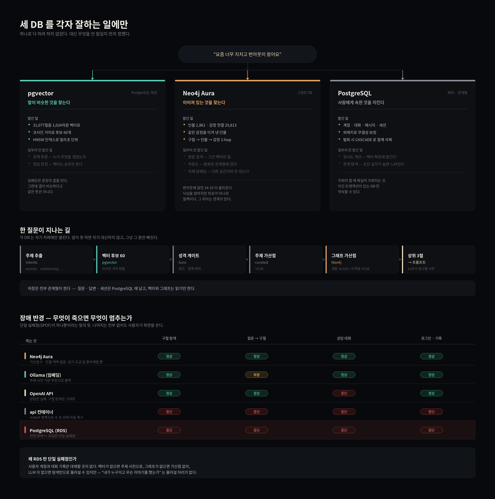

# 설계 회고 — 세 DB 의 분업, 그리고 장애 내성

WBS 회고의 "잘된 것" 두 항목을 자세히 적는다.



---

## 1. 세 DB 를 각자 잘하는 일에만 썼다

### 1.1 왜 나눴는가

처음에 한 DB 로 다 하는 안을 검토했다. Postgres 하나에 pgvector 를 얹고
인물 관계는 조인으로 풀면 인프라가 하나로 끝난다. 그런데 이런 질의를
써 보면서 접었다.

> "번아웃(감정)을 겪은 인물이 등장하고, 그중 그 감정을 이겨 낸 사람이
> 나오는 구절"

관계형으로 쓰면 3~4단 조인이 되고, 인물이 늘수록 느려진다. 반면 그래프
DB 는 이게 기본 문법이다. 두 홉짜리 패턴 한 줄이다.

```cypher
MATCH (v:Verse)-[:MENTIONS]->(p:Person)-[:OVERCAME]->(e:EmotionOrState {theme: $theme})
```

반대로 "31,077개 벡터에서 가장 가까운 60개" 는 그래프 DB 가 잘하는 일이
아니다. 그건 인덱스 구조의 문제고, pgvector 의 HNSW 가 밀리초 단위로 한다.

**그래서 기준을 이렇게 세웠다 — 무엇을 맡길지가 아니라 무엇을 안 맡길지를
먼저 정한다.**

### 1.2 세 갈래

#### pgvector · "말이 비슷한 것"

| | |
|---|---|
| **맡긴 일** | 31,077절을 1,024차원 벡터로. 코사인 거리로 후보 60개. HNSW 인덱스 |
| **안 맡긴 일** | 관계 추론 (누가 무엇을 겪었는지) · 정답 판정 |

임베딩은 문장의 결을 안다. 그런데 결이 비슷하다고 같은 뜻은 아니다.
그래서 벡터에는 **순위만** 맡기고 판정은 다음 층으로 넘긴다.

`ORDER BY embedding <=> %s::vector LIMIT 60` — 60개를 넉넉히 건지는 이유도
같다. 여기서 3개만 뽑으면 뒤에서 걸러 낸 자리를 채울 것이 없다.

#### Neo4j · "이어져 있는 것"

| | |
|---|---|
| **맡긴 일** | 인물 2,861 · 감정 연결 29,813. 구절 → 인물 → 감정 2-hop. 같은 감정을 **이겨 낸** 인물 찾기 |
| **안 맡긴 일** | 본문 검색 · 원본 저장 · 자체 임베딩 사용 |

그래프에도 1,536차원 임베딩과 벡터 인덱스가 있다. **쓰지 않았다.**
우리 pgvector 는 qwen3-embedding:8b 로 만든 다른 공간이라, 두 공간의
점수를 섞으면 숫자는 나오지만 뜻이 없다.

이 갈래가 필요했던 이유는 실측에서 나왔다.

```
질문: "요즘 너무 지치고 번아웃이 왔어요"
벡터 결과 3위: 잠언 24:10 "네가 만일 환난 날에 낙담하면 네 힘이 미약함을 보임이니라"
```

낙심을 말하는 구절이라 문장은 비슷하다. 하지만 이건 위로가 아니라 질책이다.
**그 차이는 본문에 없고 관계에 있다.** 그래서 `OVERCAME` — 그 감정을
지나간 인물이 등장하는 구절에 가산점을 준다.

#### PostgreSQL (관계형) · "사람에게 속한 것"

| | |
|---|---|
| **맡긴 일** | 계정 · 대화 · 메시지 · 세션. 외래키 무결성. 탈퇴 시 CASCADE |
| **안 맡긴 일** | 유사도 계산 · 깊은 관계 탐색 |

"지워야 할 때 확실히 지워지는 것" — 탈퇴하면 대화 기록도 함께 사라져야
한다. 이건 트랜잭션과 외래키가 있는 DB 만 약속할 수 있다.

### 1.3 한 질문이 지나는 길

```
질문
 │
 ├─ ① intents        주제 추출          "anxiety" · "relationship" …
 ├─ ② pgvector       후보 60개          코사인 거리 정렬
 ├─ ③ tone           성격 게이트        경고 · 질책 구절 제외
 ├─ ④ curated        주제 가산점        +0.06
 ├─ ⑤ Neo4j          그래프 가산점      겪음 +0.015 / 이겨냄 +0.04
 └─ ⑥ 상위 3절 → LLM 프롬프트
                                          답변은 PostgreSQL 에 저장
```

**각 층은 자기 차례에만 불린다.** 앞이 못 하면 뒤가 대신하지 않고, 그냥
그 층만 빠진다. `_graph_boost()` 가 빈 dict 를 돌려주면 ⑤ 가 0 이 될 뿐
①~④ 는 그대로다.

### 1.4 가중치를 실측으로 정한 이야기

그래프 가산점을 처음엔 0.04 로 뒀다. 붙이고 나서 재 보니 이렇게 나왔다.

```
0.7600  데살로니가후서 3:13   theme + graph
0.7223  마태복음 11:28        theme
```

번아웃에 대한 가장 강한 위로인 마 11:28 이 2위로 밀렸다. 후보들의 벡터
점수를 보니 **0.66~0.68 사이에 몰려 있었다 — 폭이 0.02.** 가산점 0.04 는
그 폭 전체와 맞먹어서, 동점을 가르는 게 아니라 순위를 새로 쓰고 있었다.

0.015 / 0.04, 상한 0.05 로 낮췄다. **주제 가산점(0.06)보다 작게** 둔 것도
같은 이유다 — 사람이 직접 배정한 판단이 그래프 추론보다 신뢰도가 높다.

그리고 이 기준선을 테스트로 못 박았다.

```python
def test_가산점_폭이_후보_점수_폭보다_좁다(self):
    OBSERVED_SPREAD = 0.02
    self.assertLessEqual(graph.MAX_BOOST, OBSERVED_SPREAD * 3)
```

### 1.5 허브 제외도 실측이 답을 줬다

처음엔 "테마를 많이 가진 인물이 허브" 라고 봤다. 여호와가 12종 테마 전부에
걸려 있었기 때문이다. 그런데 4종으로 자르니 **그래프가 아무 일도 안 하게
됐다.** 다윗도 11종이었던 것이다.

```
여호와    6,020절   테마 12   ← 빠져야 한다
예수      1,877절   테마 10   ← 빠져야 한다
이스라엘    982절   테마 11
다윗        928절   테마 11   ← 남아야 한다 (시편의 절반)
베드로      163절   테마  9
```

**여호와가 쓸모없는 이유는 감정이 많아서가 아니라 어디에나 있어서였다.**
재야 할 것은 감정의 폭이 아니라 등장 범위였고, `MENTIONS` 차수 1,000 으로
바꾸니 어디에나 있는 둘만 빠지고 나머지는 남았다.

이름을 하드코딩하지 않은 것도 판단이다. 목록으로 막으면 적재가 바뀌어 새
허브가 생길 때마다 고쳐야 하고, 고치기 전까지는 조용히 잡음이 낀다.

---

## 2. 단일 실패점이 RDS 하나뿐이라는 말의 뜻

### 2.1 단일 실패점(SPOF)이란

그것 하나가 죽으면 **서비스 전체가 멈추는** 지점이다. 반대로 말하면,
SPOF 가 아닌 것들은 죽어도 사용자가 뭔가는 할 수 있다.

우리 시스템에는 외부 의존이 넷 있다.

```
Neo4j Aura · Ollama(임베딩) · OpenAI API · PostgreSQL(RDS)
```

이 중 **셋은 죽어도 화면이 뜬다.** 하나만 SPOF 다.

### 2.2 장애 반경 지도

| 죽는 것 | 구절 탐색 | 질문 → 구절 | 상담 대화 | 로그인 · 기록 |
|---|:---:|:---:|:---:|:---:|
| **Neo4j Aura** | 정상 | 정상 | 정상 | 정상 |
| **Ollama (임베딩)** | 정상 | 부분 | 정상 | 정상 |
| **OpenAI API** | 정상 | 정상 | 중단 | 정상 |
| **api 컨테이너** | 중단 | 중단 | 중단 | 중단 |
| **PostgreSQL (RDS)** | 중단 | 중단 | 중단 | 중단 |

#### Neo4j 가 죽으면 — 아무것도 안 멈춘다

모든 그래프 함수가 예외 대신 빈 값을 돌려준다. 연결 3초, 질의 2초 타임아웃.

```python
try:
    driver = _get_driver()
    if driver is None:
        return []
    ...
except Exception as exc:
    logger.warning("Cypher 실패 — 그래프 없이 진행합니다: %s", exc)
    return []
```

가산점이 0 이 되고 상담 프롬프트에 인물 맥락이 안 들어간다. **답이 조금
덜 풍부해질 뿐, 사용자는 눈치채지 못한다.**

> 이 구조 덕에 팀원의 그래프 적재가 8/5까지 이어졌는데도 일정이 안 밀렸다.
> 8/6에 붙이는 것만으로 결합이 끝났다.

#### Ollama 가 죽으면 — 검색만 물러선다

질문을 임베딩할 수 없으니 벡터 검색이 안 된다. 그때는 예전 방식인 주제
사전 기반 추천으로 물러선다.

```python
def ready() -> bool:
    if connection.vendor != "postgresql":
        return False
    return EmbeddingRun.objects.exists()
```

추천 품질이 떨어지지만 구절은 나온다. 화면은 그대로다.

#### OpenAI 가 죽으면 — 상담만 멈춘다

대화는 실패하지만 **구절 탐색·은하수·검색은 전부 살아 있다.** 이 서비스에서
"성경을 둘러본다" 는 경험은 LLM 과 무관하게 성립한다.

#### RDS 가 죽으면 — 전부 멈춘다

이것만 대체할 곳이 없다.

- **사용자 계정** — 누가 로그인했는지 알 수 없다
- **대화 기록** — 지난 상담을 불러올 수 없다
- **구절 데이터** — 화면에 그릴 별 2,652개가 여기 있다
- **임베딩 벡터** — 검색의 원천

### 2.3 왜 RDS 만 SPOF 인가

패턴이 하나 있다.

> **대체 표현이 있는 것은 물러설 수 있다. 사실 그 자체인 것은 물러설 수 없다.**

| 죽은 것 | 물러설 곳 | 왜 가능한가 |
|---|---|---|
| 그래프 가산점 | 가산점 없이 | 순위를 다듬는 값이지 순위 그 자체가 아니다 |
| 벡터 검색 | 주제 사전 | 같은 질문에 다른 방법으로 답할 수 있다 |
| LLM 답변 | 구절 탐색만 | 서비스의 한 갈래일 뿐이다 |
| **계정 · 대화** | **없음** | "내가 누구이고 무슨 이야기를 했는가" 는 계산으로 만들 수 없다 |

앞의 셋은 **가공된 결과**다. 원천이 있으면 다시 만들 수 있다.
마지막 하나는 **원천 그 자체**다. 없으면 만들 방법이 없다.

### 2.4 이 구조를 만든 세 가지 규칙

**① 재료와 답을 나눈다**

그래프는 답을 더 좋게 만드는 재료이지 답을 만드는 재료가 아니다.
재료 하나가 없다고 화면이 안 뜨면 그건 설계가 잘못된 것이다.

**② 실패를 조용하게, 그러나 기록은 남긴다**

```python
except Exception as exc:
    logger.warning("그래프 가산점 계산 실패 — 벡터 점수만 씁니다: %s", exc)
    return {}
```

사용자에게는 아무 일도 없지만 로그에는 남는다. 조용한 것과 숨기는 것은 다르다.

**③ 폴백을 테스트한다**

정상 경로보다 **실패 경로를 더 많이 테스트했다.** 그래프 테스트 16개 중
9개가 "죽었을 때 어떻게 되는가" 다.

| 케이스 | 왜 |
|---|---|
| 자격 증명 없음 → 빈 값 | 팀원 대부분의 로컬 환경 |
| 드라이버 생성 실패 → 예외 안 샘 | 실제로 여기서 샜다 |
| 질의 실패 → 빈 dict | 발표 중 세션 만료 시나리오 |
| **응답 모양이 달라도 KeyError 안 남** | 스키마가 바뀌면 검색 전체가 500 이 된다 |

마지막 것은 실제 결함이었다. Cypher 는 성공했는데 응답 파싱이 `KeyError`
로 터져서 **가산점 하나 때문에 검색 요청 전체가 500** 이 됐다.

### 2.5 남은 위험과 다음 단계

RDS 가 SPOF 라는 사실은 **수용한 위험**이지 모르고 넘어간 것이 아니다.
지금 규모(발표 시연)에서는 다중 AZ 비용이 이득보다 크다고 판단했다.

늘린다면 순서는 이렇다.

| 단계 | 조치 | 얻는 것 |
|---|---|---|
| 1 | RDS 다중 AZ | 가용 영역 하나가 죽어도 자동 전환 |
| 2 | 읽기 복제본 | 구절 조회를 복제본으로 — 쓰기 장애와 읽기 장애 분리 |
| 3 | 구절 데이터 캐시 (Redis) | RDS 가 죽어도 **읽기 전용 모드**로 탐색은 유지 |

3단계까지 가면 RDS 장애 시에도 "로그인은 안 되지만 성경은 볼 수 있다" 가
된다. 그때는 SPOF 가 사라진다.

---

## 3. 발표에서 물으면

**"왜 DB 를 세 개나 썼나요?"**

> 하나로 다 하려다 접었습니다. "이 감정을 이겨 낸 인물이 나오는 구절" 을
> 관계형으로 쓰면 4단 조인이 되는데, 그래프에서는 두 홉짜리 한 줄입니다.
> 반대로 31,077개 벡터에서 최근접을 찾는 건 그래프가 잘하는 일이 아닙니다.
> 각자 잘하는 일에만 맡기고, **무엇을 안 맡길지를 먼저 정했습니다.**

**"그래프가 죽으면 어떻게 되나요?"**

> 아무 일도 안 일어납니다. 모든 그래프 함수가 예외 대신 빈 값을 돌려주고,
> 가산점이 0 이 될 뿐입니다. 답이 조금 덜 풍부해지지만 사용자는 모릅니다.
> 그래프는 답을 좋게 만드는 재료이지 답을 만드는 재료가 아니니까요.

**"단일 실패점은 없나요?"**

> RDS 하나 있습니다. 벡터가 없으면 주제 사전으로, 그래프가 없으면 가산점
> 없이, LLM 이 없으면 탐색만으로 물러설 수 있는데 — "내가 누구이고 무슨
> 이야기를 했는가" 는 물러설 자리가 없습니다. 계산으로 만들 수 없는 유일한
> 데이터라서요. 지금 규모에서는 수용한 위험이고, 늘린다면 다중 AZ → 읽기
> 복제본 → 구절 캐시 순으로 갑니다.
