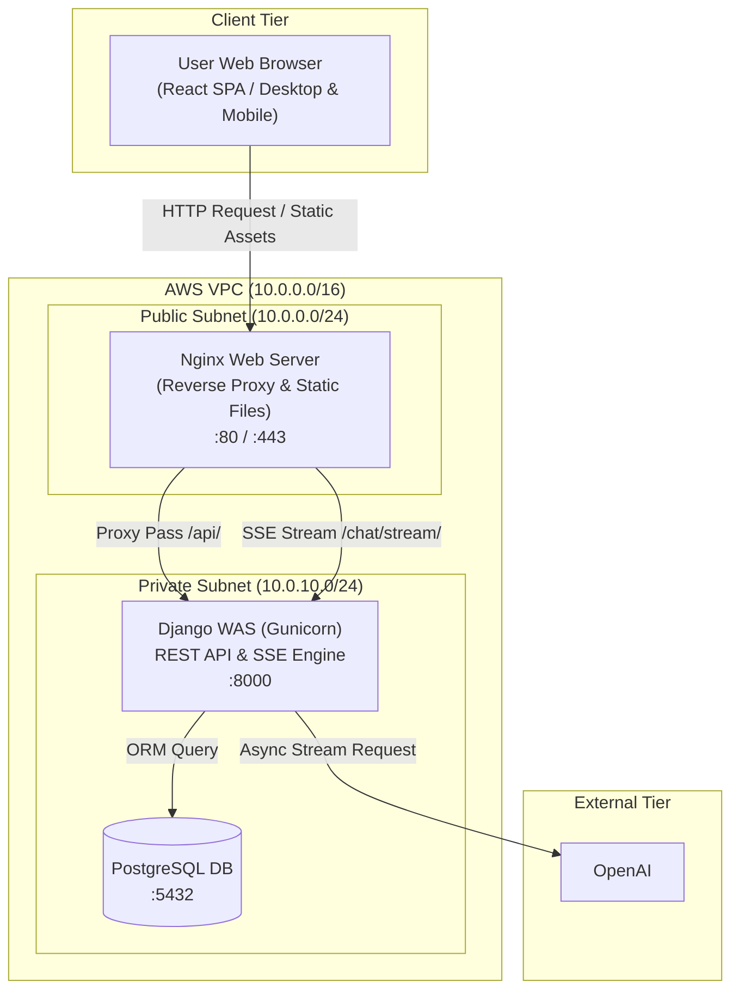
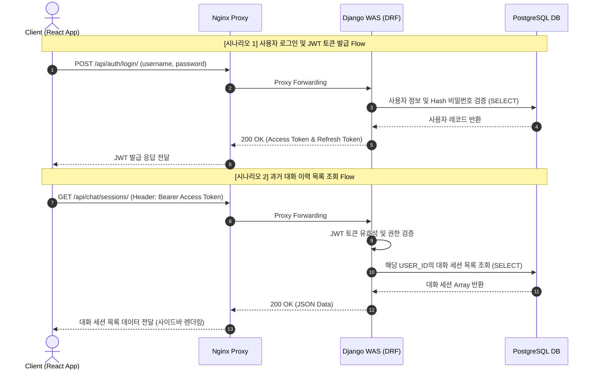
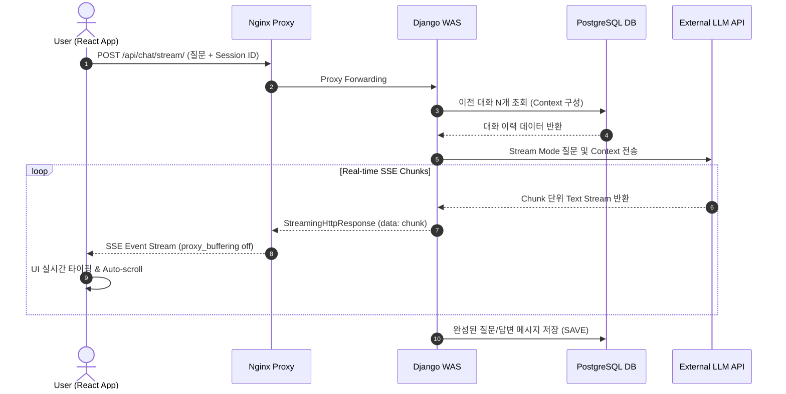

# Django & React 기반 LLM 챗봇 서비스 시스템 구성도

## 1. 개요

본 문서는 Django REST Framework 백엔드, React SPA 프론트엔드, PostgreSQL 데이터베이스, 외부 LLM API(OpenAI/Gemini)로 구성된 LLM 챗봇 웹 서비스의 시스템 아키텍처 및 데이터 흐름, 배포 및 클라우드 컨테이너 환경을 정의한 문서이다.

| 항목 | 내용 |
|---|---|
| 프로젝트명 | Django & React 기반 LLM 챗봇 서비스 웹 애플리케이션 |
| 문서명 | 시스템 구성도 |
| 작성일 | 2026-07-30 ~ 2026-08-07 |
| 작성자 | 김가율 |
| 문서 버전 | v2.0 |
| 개발 스택 | React (Vite, Axios), Django REST Framework, OpenAI API, PostgreSQL/SQLite, Nginx, Docker |

---

## 2. 전체 시스템 아키텍처 다이어그램


* **구상 설명 (Diagram Structure)**:
  * **Client Tier**: Web Browser (Desktop / Mobile Device)
  * **AWS Infrastructure (VPC: 10.0.0.0/16)**:
    * **Public Subnet (10.0.1.0/24)**: Nginx Web Server (Reverse Proxy & Static File Host)
    * **Private Subnet (10.0.2.0/24)**: Django Application Server (Gunicorn WSGI/ASGI WAS Container), PostgreSQL RDS Container
  * **External Tier**: External LLM API Service (OpenAI / Gemini API Endpoint)

---

## 3. 계층별 상세 구성 및 역할

### 3.1 Client Tier
* **구성 요소**: React 18 SPA (Vite 빌드)
* **역할**:
  * 사용자 UI/UX 제공 (챗봇 대화창, 대화 이력 사이드바, 마이페이지)
  * JWT (Access Token 메모리 관리 / Refresh Token HttpOnly Cookie) 기반 인증 유지
  * Server-Sent Events (SSE) `EventSource` / `fetch-event-source`를 통한 Chunk 단위 실시간 텍스트 타이핑 렌더링

### 3.2 Web / Proxy Tier (Public Subnet)
* **구성 요소**: Nginx Web Server (Docker Container)
* **역할**:
  * 80(HTTP), 443(HTTPS) 포트 요청 수신 및 SSL/TLS 암호화 종단
  * React 빌드 정적 자원(HTML/JS/CSS) 서빙
  * `/api/` 및 `/chat/stream/` 경로 요청을 Application Tier로 Reverse Proxy 포워딩
  * **SSE 필수 설정**: `proxy_buffering off;`, `proxy_cache off;`, `proxy_read_timeout 3600s;` 적용으로 스트리밍 지연 방지

### 3.3 Application Tier (Private Subnet)
* **구성 요소**: Python 3.11+, Django 5.x / DRF, Gunicorn WAS Container
* **역할**:
  * 사용자 회원가입, JWT 인증, 세션/이력 관리 RESTful API 제공
  * LLM 연동 모듈: 사용자 질문 수신 시 최근 N개 메시지 Context 조합 후 외부 LLM API 호출
  * `StreamingHttpResponse`를 통한 Chunk 데이터 비동기 SSE 파이프라인 형성 및 클라이언트 중계
  * `.env` 환경 변수를 활용한 외부 API Key 및 DB Credential 보안 관리

### 3.4 Data Tier (Private Subnet)
* **구성 요소**: PostgreSQL Database (Docker Volume persistent storage / AWS RDS)
* **역할**:
  * `DATA-USER` (사용자 계정 정보), `DATA-SESSION` (대화 세션), `DATA-MESSAGE` (질문/답변 메시지 내역) 영속 저장
  * 외부 접근 전면 차단 (Application Tier 내부 네트워크인 `app-network`에서만 접근 허용)

### 3.5 External Tier
* **구성 요소**: OpenAI API
* **역할**:
  * 프롬프트 및 대화 문맥(Context)을 수신하여 LLM 답변 생성 후 Chunk 단위 Stream 데이터 반환

---

## 4. 전체 데이터 흐름도 (Data Flow Diagram)

### 4.1 동기식 REST API 흐름 (인증, 이력 조회)

* **흐름 명세**:
  1. `Client` $\rightarrow$ `Nginx`: HTTP POST `/api/auth/login/` 요청
  2. `Nginx` $\rightarrow$ `Django`: Reverse Proxy 포워딩 (포트 8000)
  3. `Django` $\rightarrow$ `PostgreSQL`: 사용자 인증 정보 조회 및 비밀번호 Hash 검증
  4. `Django` $\rightarrow$ `Client`: JWT Access Token 및 Refresh Token 반환

* **흐름 요약**
  * 로그인 시나리오: 클라이언트의 로그인 요청이 Nginx를 거쳐 Django로 전달되고, DB의 사용자 정보와 비밀번호 해시를 검증한 후 JWT 토큰을 발급해 반환하는 과정을 보여줍니다.

  * 대화 이력 조회 시나리오: JWT Access Token을 헤더에 담아 요청하면, Django 인증 필터를 거쳐 해당 사용자의 대화 세션 목록을 DB에서 조회 후 클라이언트로 전달하는 과정을 보여줍니다. 

### 4.2 비동기 SSE 스트리밍 대화 흐름 (LLM 질의응답)

* **흐름 명세**:
  1. `Client` $\rightarrow$ `Nginx` $\rightarrow$ `Django`: HTTP POST `/api/chat/stream/` (질문 + Session ID)
  2. `Django` $\rightarrow$ `PostgreSQL`: 해당 세션의 최근 N개 대화 히스토리 조회 (Context 구성)
  3. `Django` $\rightarrow$ `External LLM API`: Context + 신규 질문 전달하여 Stream Mode 호출
  4. `External LLM API` $\rightarrow$ `Django`: Chunk 단위로 Text Stream 반환
  5. `Django` $\rightarrow$ `Nginx` $\rightarrow$ `Client`: `StreamingHttpResponse`를 통해 SSE `data: {"chunk": "..."}` 전송 (`proxy_buffering off;`)
  6. `Client`: Chunk 수신 즉시 UI 렌더링 및 화면 Auto-scroll
  7. `Django` $\rightarrow$ `PostgreSQL`: 스트리밍 완료 후 전체 완성된 메시지를 DB에 영속 저장

* **흐름 요약**:
  * 대화 문맥(Context) 구성: 클라이언트가 질문과 세션 ID를 전송하면, Django 백엔드가 DB에서 해당 세션의 이전 대화 이력 N개를 조회하여 외부 LLM API에 전달할 대화 문맥을 생성합니다.
  * 외부 LLM API 비동기 스트림 호출: 백엔드는 구성된 대화 문맥과 신규 질문을 포함하여 외부 LLM API(OpenAI)를 Stream 모드로 비동기 호출합니다.
  * 실시간 Chunk 데이터 단방향 중계: LLM API로부터 생성되는 텍스트가 Chunk 단위로 반환될 때마다 Django의 StreamingHttpResponse와 Nginx의 버퍼링 해제(proxy_buffering off;) 설정을 통해 클라이언트로 실시간 SSE(data: {"chunk": "..."}) 이벤트를 전달합니다.
  * 클라이언트 UI 렌더링 및 자동 스크롤: React 클라이언트는 수신되는 Chunk 데이터를 실시간으로 타이핑 렌더링하고, 대화창 스크롤을 최하단으로 자동 유지(Auto-scroll)하여 사용자 경험을 향상시킵니다.
  * 최종 메시지 영속 저장: 스트리밍이 최종 완료되면 생성된 전체 답변 메시지를 DB(CHAT_MESSAGES)에 영속 저장하여 대화 이력을 관리합니다.
---

## 5. 배포 아키텍처 및 Docker 컨테이너 구성

### 5.1 Docker Compose 서비스 구조
```
+-------------------------------------------------------------------------------+
|                       AWS EC2 Instance (Docker Engine)                        |
|                                                                               |
|   +-----------------------------------------------------------------------+   |
|   |                       app-network (Bridge Network)                    |   |
|   |                                                                       |   |
|   |   +------------------------+             +------------------------+   |   |
|   |   |    nginx-container     | --(Proxy)-->|   backend-container    |   |   |
|   |   |  (Nginx / Static SPA)  |   :8000     |   (Django / Gunicorn)  |   |   |
|   |   |    Port 80:80, 443     |             +------------------------+   |   |
|   |   +------------------------+                         |                |   |
|   |                |                                (ORM Connection)      |   |
|   |                v                                     v                |   |
|   |         [User Browser]                   +------------------------+   |   |
|   |                                          |      db-container      |   |   |
|   |                                          | (PostgreSQL Container) |   |   |
|   |                                          +------------------------+   |   |
|   |                                                      |                |   |
|   +------------------------------------------------------|----------------+   |
|                                                          v                    |
|                                              [Volume: postgres_data]          |
+-------------------------------------------------------------------------------+
```

* **서비스 구성 명세**:
  * `nginx-container`: Port `80:80`, `443:443` 바인딩, `app-network` 연결
  * `backend-container` (Django): internal Port `8000`, `app-network` 연결, `env_file: .env`
  * `db-container` (PostgreSQL): internal Port `5432`, `app-network` 연결, Volume `postgres_data` 바인딩

* **흐름 요약**:
  * 컨테이너 기반 서비스 격리: Nginx 웹 서버 (nginx), Django WAS (backend), PostgreSQL DB (db)를 각각 독립된 Docker 컨테이너로 분리하여 실행 환경의 일관성과 독립성을 확보합니다.
  * 격리된 내부 브리지 네트워크 (app-network): 모든 컨테이너를 외부망과 분리된 동일한 내부 브리지 네트워크에 바인딩하여, 외부 노출 없이 컨테이너 서비스 이름(Hostname) 기반의 내부 통신을 수행합니다.
  * 포트 바인딩 및 외부 접근 제어: Nginx 컨테이너만 외부 포트(80:80, 443:443)를 오픈하고, Django(8000) 및 PostgreSQL(5432)은 외부 포트 바인딩을 차단하여 보안성을 강화합니다.
  * 정적 파일 서빙 및 리버스 프록시 연계: Nginx 컨테이너는 React 빌드 정적 자원(dist) 및 Nginx 설정 파일을 볼륨으로 공유받아 직접 서빙하며, /api/ 패스 요청은 backend:8000 컨테이너로 프록시 포워딩합니다.
  * 데이터 영속성 확보 (Named Volume): DB 컨테이너의 데이터 저장 경로(/var/lib/postgresql/data)를 Docker Named Volume(postgres_data)과 바인딩하여 컨테이너 재시작 또는 삭제 시에도 데이터가 영구 유지되도록 구성합니다.

```yaml
# docker-compose.yml 개요 구조
version: '3.8'

services:
  nginx:
    image: nginx:alpine
    ports:
      - "80:80"
    volumes:
      - ./deploy/nginx:/etc/nginx/conf.d
      - ./frontend/dist:/usr/share/nginx/html
    depends_on:
      - backend
    networks:
      - app-network

  backend:
    build: ./backend
    command: gunicorn config.wsgi:application --bind 0.0.0.0:8000
    env_file:
      - .env
    depends_on:
      - db
    networks:
      - app-network

  db:
    image: postgres:15-alpine
    volumes:
      - postgres_data:/var/lib/postgresql/data
    environment:
      - POSTGRES_DB=chatbotdb
      - POSTGRES_USER=chatbotuser
      - POSTGRES_PASSWORD=secretpass
    networks:
      - app-network

networks:
  app-network:
    driver: bridge

volumes:
  postgres_data:
```
## 6. 보안 및 확장성 설계
| 보안/확장 항목 | 설계 및 적용 내용 |
|---|---|
| 네트워크 격리 (AWS Security Group) | - Public Subnet: 80, 443 포트만 허용 <br> - Private Subnet: WAS(8000) 및 DB(5432) 외부 접근 전면 차단 |
| API Key 보안 | 외부 LLM API Key는 서버 환경 변수(.env)에 격리하며 클라이언트에 절대 노출 금지 |
| 인증/인가 (JWT & CORS) | CorsHeaders 미들웨어로 허용 도메인 제한, Protected Route 및 Django REST Framework 권한 검증 |
| 성능 및 확장성 | Stateless한 Django Container 구성으로 향후 Traffic 증가 시 AWS ECS/Auto Scaling을 통한 Horizontal Scaling 지원|
