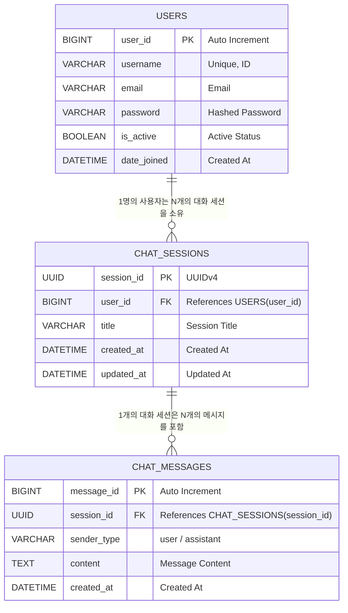

# Django & React 기반 LLM 챗봇 서비스 테이블 정의서

## 1. 개요 및 ERD 구성

본 문서는 Django & React 기반 LLM 챗봇 서비스의 영속성 데이터 관리를 위한 데이터베이스 테이블 상세 명세서이다. 사용자 정보, 대화 세션, 메시지 내역 모델을 포함한다.

| 항목 | 내용 |
|---|---|
| 프로젝트명 | Django & React 기반 LLM 챗봇 서비스 웹 애플리케이션 |
| 문서명 | 테이블 정의서 |
| 작성일 | 2026-08-06 |
| 작성자 | 김가율 |
| 문서 버전 | v2.0 |
| 개발 스택 | React (Vite, Axios), Django REST Framework, OpenAI API, PostgreSQL/SQLite, Nginx, Docker |
---

* **테이블 간 관계 (ERD Summary)**:
  * `USERS` (1) $\longleftrightarrow$ ($\mathbf{N}$) `CHAT_SESSIONS` (사용자 1명은 여러 대화 세션을 생성)
  * `CHAT_SESSIONS` (1) $\longleftrightarrow$ ($\mathbf{N}$) `CHAT_MESSAGES` (대화 세션 1개는 여러 메시지를 포함)

---

## 2. 테이블 상세 명세

### 2.1 USERS (사용자 테이블)

#### 기본 정보
* **테이블 ID**: `USERS` (`auth_user` 또는 Custom User Model)
* **테이블 설명**: 시스템에 가입한 사용자 계정 및 인증 정보를 저장하는 테이블

#### 컬럼 정보
| 컬럼명 | 데이터 타입 | 길이 | NULL 허용 | 기본값 | PK/FK | 설명 |
|---|---|---|---|---|---|---|
| `USER_ID` | BIGINT / INT | - | N | Auto Increment | PK | 사용자 고유 식별자 |
| `USERNAME` | VARCHAR | 150 | N | - | - | 로그인 아이디 (Unique) |
| `EMAIL` | VARCHAR | 254 | N | - | - | 사용자 이메일 주소 |
| `PASSWORD` | VARCHAR | 128 | N | - | - | 암호화된 비밀번호 Hash (PBKDF2) |
| `IS_ACTIVE` | BOOLEAN | - | N | TRUE | - | 계정 활성화 여부 |
| `DATE_JOINED` | DATETIME | - | N | CURRENT_TIMESTAMP | - | 회원가입 일시 |
| `LAST_LOGIN` | DATETIME | - | Y | NULL | - | 최근 로그인 일시 |

#### 제약 조건 및 인덱스
| 제약/인덱스 명 | 구분 | 대상 컬럼 | 설명 |
|---|---|---|---|
| `PK_USERS` | Primary Key | `USER_ID` | 사용자 식별 기본키 |
| `UQ_USERS_USERNAME` | Unique | `USERNAME` | 아이디 중복 방지 |
| `IDX_USERS_USERNAME` | Index | `USERNAME` | 로그인 인증 조회 속도 최적화 |

---

### 2.2 CHAT_SESSIONS (대화 세션 테이블)

#### 기본 정보
* **테이블 ID**: `CHAT_SESSIONS`
* **테이블 설명**: 사용자가 생성한 각각의 챗봇 대화방(세션) 정보를 관리하는 테이블

#### 컬럼 정보
| 컬럼명 | 데이터 타입 | 길이 | NULL 허용 | 기본값 | PK/FK | 설명 |
|---|---|---|---|---|---|---|
| `SESSION_ID` | UUID / VARCHAR | 36 | N | UUIDv4 | PK | 대화 세션 고유 식별자 |
| `USER_ID` | BIGINT / INT | - | N | - | FK | 세션을 소유한 사용자 ID |
| `TITLE` | VARCHAR | 255 | N | '새로운 대화' | - | 대화방 제목 (첫 질문 기반 자동생성) |
| `CREATED_AT` | DATETIME | - | N | CURRENT_TIMESTAMP | - | 세션 생성 일시 |
| `UPDATED_AT` | DATETIME | - | N | CURRENT_TIMESTAMP | - | 최근 대화 발생 일시 |

#### 제약 조건 및 인덱스
| 제약/인덱스 명 | 구분 | 대상 컬럼 | 설명 |
|---|---|---|---|
| `PK_CHAT_SESSIONS` | Primary Key | `SESSION_ID` | 대화 세션 기본키 |
| `FK_SESSIONS_USER` | Foreign Key | `USER_ID` | `USERS.USER_ID` 참조 (ON DELETE CASCADE) |
| `IDX_SESSIONS_USER_UPDATED` | Multi Index | `USER_ID`, `UPDATED_AT` | 사용자별 최근 대화 목록 정렬 조회 최적화 |

---

### 2.3 CHAT_MESSAGES (대화 메시지 테이블)

#### 기본 정보
* **테이블 ID**: `CHAT_MESSAGES`
* **테이블 설명**: 각 대화 세션 내에서 주고받은 사용자 질문 및 LLM 답변 메시지 개별 항목을 저장하는 테이블

#### 컬럼 정보
| 컬럼명 | 데이터 타입 | 길이 | NULL 허용 | 기본값 | PK/FK | 설명 |
|---|---|---|---|---|---|---|
| `MESSAGE_ID` | BIGINT / INT | - | N | Auto Increment | PK | 메시지 고유 식별자 |
| `SESSION_ID` | UUID / VARCHAR | 36 | N | - | FK | 메시지가 속한 대화 세션 ID |
| `SENDER_TYPE` | VARCHAR | 20 | N | - | - | 발화 주체 ('user' 또는 'assistant') |
| `CONTENT` | TEXT | - | N | - | - | 메시지 본문 내용 (마크다운 텍스트 포함) |
| `CREATED_AT` | DATETIME | - | N | CURRENT_TIMESTAMP | - | 메시지 생성/발화 일시 |

#### 제약 조건 및 인덱스
| 제약/인덱스 명 | 구분 | 대상 컬럼 | 설명 |
|---|---|---|---|
| `PK_CHAT_MESSAGES` | Primary Key | `MESSAGE_ID` | 메시지 식별 기본키 |
| `FK_MESSAGES_SESSION` | Foreign Key | `SESSION_ID` | `CHAT_SESSIONS.SESSION_ID` 참조 (ON DELETE CASCADE) |
| `IDX_MESSAGES_SESSION_TIME` | Multi Index | `SESSION_ID`, `CREATED_AT` | 세션별 메시지 타임라인 순차 조회 최적화 |

---

## 3. 외래 키 (Foreign Key) 연관 관계 명세

| 연관 테이블 (Child) | 참조 테이블 (Parent) | 연관 컬럼 | ON DELETE | ON UPDATE | 비즈니스 규칙 |
|---|---|---|---|---|---|
| `CHAT_SESSIONS` | `USERS` | `USER_ID` | CASCADE | CASCADE | 사용자 회원 탈퇴 시 해당 유저의 모든 대화 세션 및 메시지 자동 삭제 |
| `CHAT_MESSAGES` | `CHAT_SESSIONS` | `SESSION_ID` | CASCADE | CASCADE | 사용자가 특정 대화 세션을 삭제하면 세션 내 모든 대화 메시지 자동 삭제 |